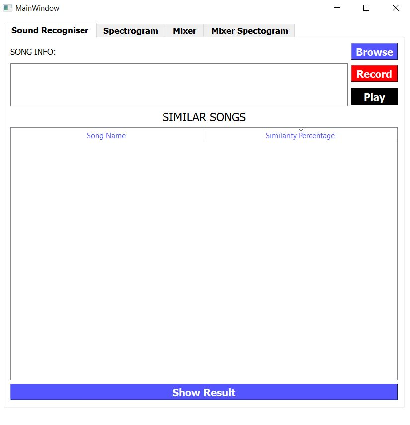
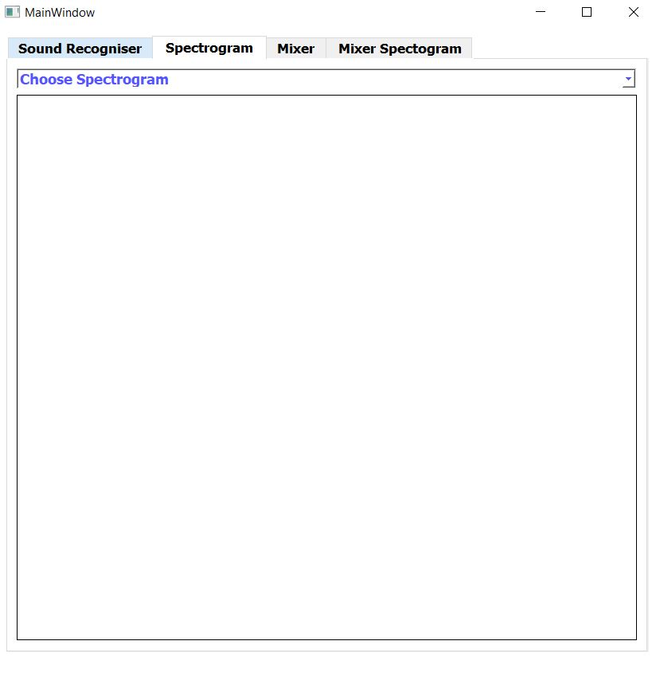
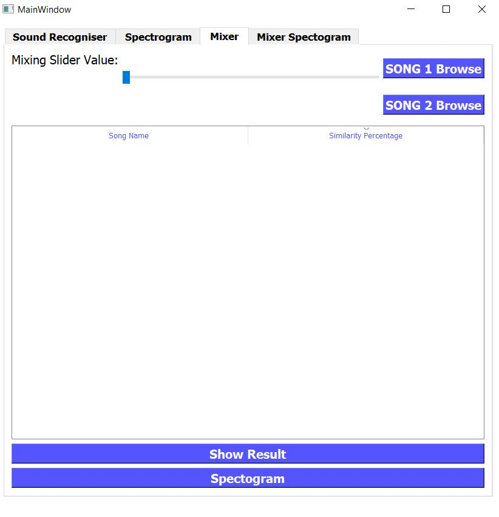
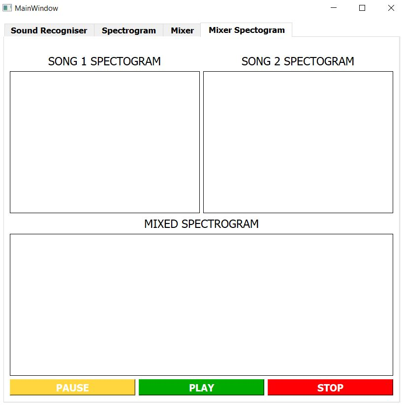
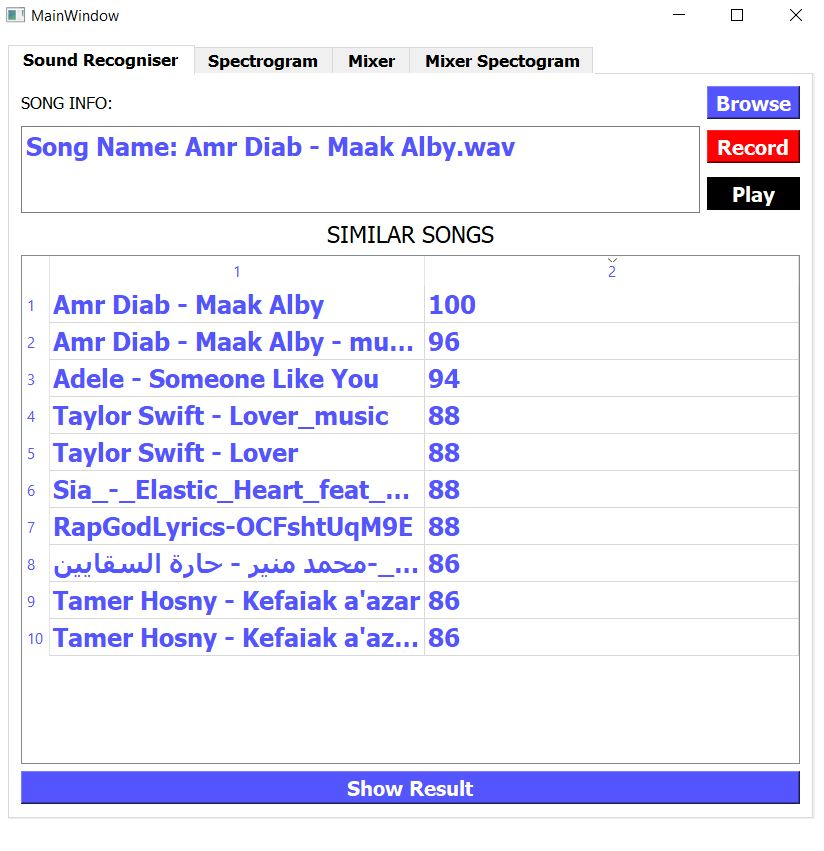
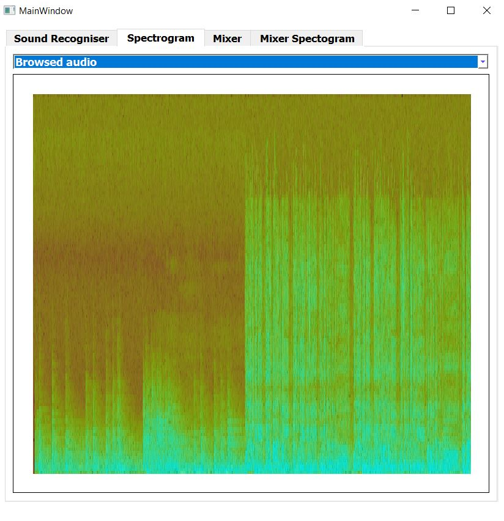
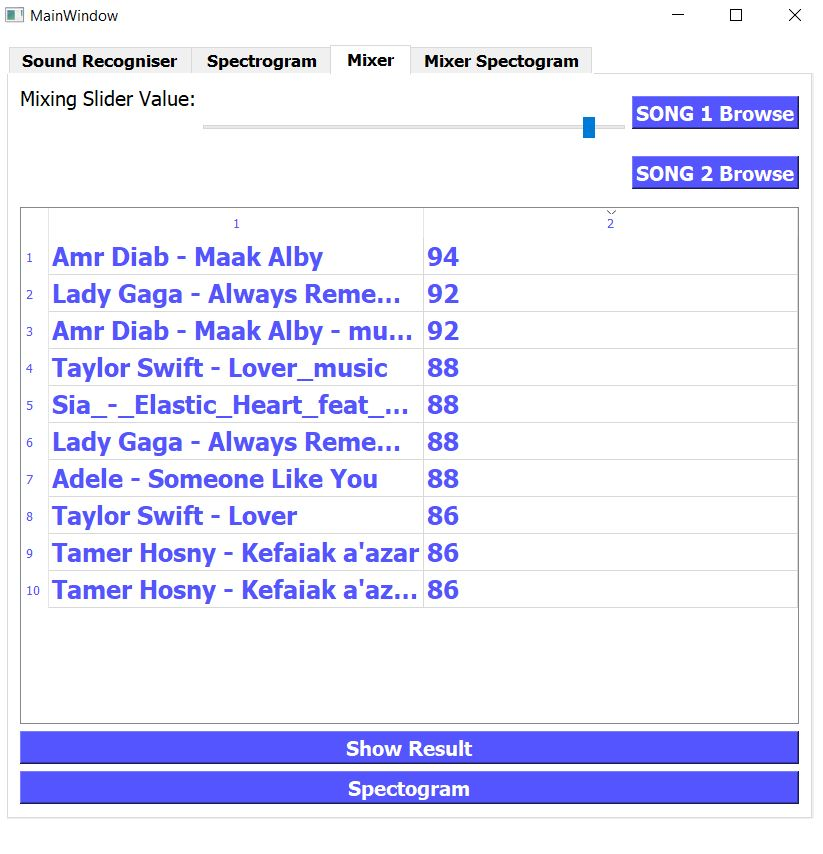
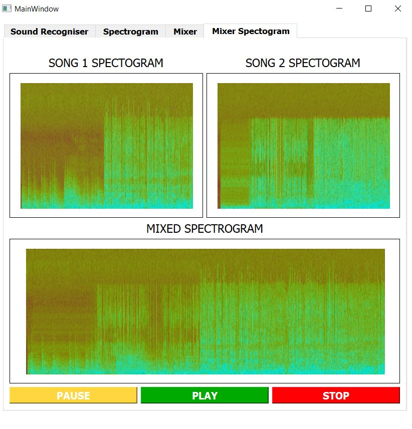
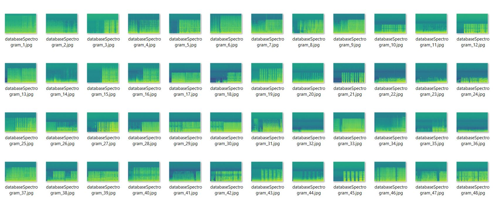
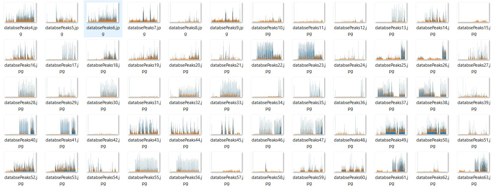

# **Sound Fingerprinting**

## **Authors**

- Ahmed El-Taher
- Ahmed Fawzi
- Mohamed Ahmed

---

## Download

**Download Fingerprinting folder which includes (main.exe + databaase.pkl)**

### [To Download click here](https://drive.google.com/drive/u/0/folders/1TuvhvBIqxUPvmLRr4Jei2K37dPLC16ZA)

---

## How To Use This Application

## Firt tab:

1. you can browse your own song and find nearst 10 similar songs.
2. you can record with you voice **(20 Seconds recording)**.

## Second tab:

1. You can See your Browsed Song Spectrogram.
2. You can See your Recorded Song Spectrogram.
   

## Third tab:

1. Browse Two Songs and mix them, then click Show Result button to see nearst 10 similar songs.

2. Value of slider initializes by 0% for first song and 100% for second song when you change slider position it increases percentage of first song and decreases percentage second song.

3. Click Spectrogram Button to see Spectrogram in fourth tab
   

## Fourth tab:

1. You can See your Both Browsed Song Spectrograms.
2. You can See your Mixed Song Spectrogram.
3. You Can play the mixed song.
   

---

## Here is an example

|               Tab 1 - Browse Song                |               Tab 2 - Spectrogram of Browsed Song               |
| :----------------------------------------------: | :-------------------------------------------------------------: |
|  |  |

|               Tab 3 - Mixing two songs                |               Tab 4 - Spectrogram for both broswed song and their mixed song               |
| :---------------------------------------------------: | :----------------------------------------------------------------------------------------: |
|  |  |

---

---

## Note:

### The repo includes [Spectrogram & Peaks] folder to see specrtograms and peaks images for all database songs

|               Sample of Spectrogram images               |               Sample of Peaks images                |
| :------------------------------------------------------: | :-------------------------------------------------: |
|  |  |
